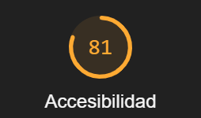
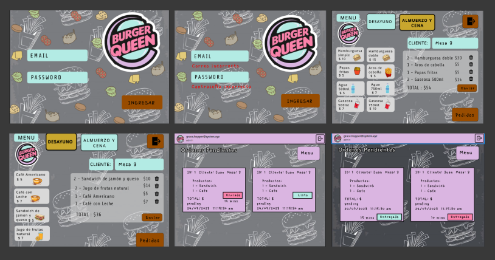
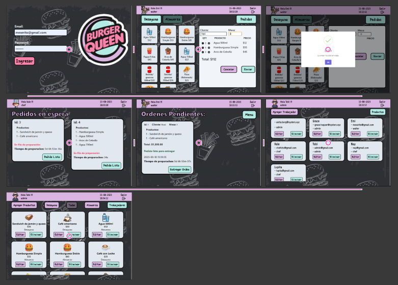

# Burger Queen  

## Índice

* [1. Sobre el proyecto](#1-sobre-el-proyecto)
* [2. Usuarios](#2-usuarios)
* [3. Mesero](#3-mesero)
* [4. Chef](#4-chef)
* [5. Administrador](#5-administrador)
* [6. Prototipo de Baja Fidelidad](#6-prototipo-de-baja-fidelidad)
* [7. Prototipo de Alta Fidelidad](#7-prototipo-de-alta-fidelidad)

***

## 1. Sobre el proyecto

Es un sistema de pedidos para un restaurante de comida rapida. Este sistema permite a los meseros tomar la orden de cada cliente desde una tablet para que estas ordenes sean enviadas a cocina. Cuando la orden se encuentre en cocina el chef podrá marcar cuando ha terminado de prepararla para enviarla nuevamente al mesero y pueda ser entregada. Además el administrado podrá agregar, editar y eliminar trabajadores y productos cuando así lo requiera.

La interfaz esta implementada como una Single Page App usando Angular, además cuenta con una puntuación de 81% en Best Practices de Lighthouse.

Para que el usuario acceda a la aplicación debe contar con credenciales correctas de acuerdo al rol que se asigne por el administrador. 

La información que proporciona el restaurante es la siguiente:

> Somos **Burguer Queen**, una cadena de comida 24hrs.
>
> Nuestra propuesta de servicio 24hrs ha tenido muy buena acogida y, para
> seguir creciendo, necesitamos un sistema que nos ayude a tomar los pedidos de
> nuestrxs clientxs.
>
> Tenemos 2 menús: uno muy sencillo para el desayuno:
>
> | Ítem                      |Precio $|
> |---------------------------|------|
> | Café americano            |    5 |
> | Café con leche            |    7 |
> | Sandwich de jamón y queso |   10 |
> | Jugo de frutas natural    |    7 |
>
> Y otro menú para el resto del día:
>
> | Ítem                      |Precio|
> |---------------------------|------|
> |**Hamburguesas**           |   **$**   |
> |Hamburguesa simple         |    10|
> |Hamburguesa doble          |    15|
> |**Acompañamientos**        |   **$**   |
> |Papas fritas               |     5|
> |Aros de cebolla            |     5|
> |**Para tomar**             |   **$**   |
> |Agua 650ml                 |     5|
> |Agua 750ml                 |     7|
> |Bebida/gaseosa 650ml       |     7|
> |Bebida/gaseosa 750ml       |     10|
>
> Nuestros clientes son bastante indecisos, por lo que es muy común que cambien
> el pedido varias veces antes de finalizarlo.

## 2. Usuarios

Para poder ingresar a la app y comenzar a usarla puedes ingresar al siguiente link: [Burger Queen]()

| Administrador         | Mesero                   | Chef                     |
|-----------------------|--------------------------|--------------------------|
|Email: admin@gmail.com |Email: meserito@gmail.com |Email: chefsito@gmail.com |
|Password: 123456       |Password: 123456          |Password: 123456          |

Es recomendable usar la app en un tablet con las siguientes dimensiones: 1180px x 820px

## 3. Mesero
### Historia de Usuario 1 
**Yo como meserx quiero poder ingresar al sistema de pedidos.**

*Acceder a una pantalla de login.

*Ingresar email y contraseña.

*Recibir mensajes de error comprensibles, dependiendo de cuál es el error con la información ingresada.

*Ingresar al sistema de pedidos si las crendenciales son correctas.
### Historia de Usuario 2
**Yo como meserx quiero tomar el pedido de unx clientx para no depender de mi mala memoria, para saber cuánto cobrar, y enviarlo a la cocina para evitar errores y que se puedan ir preparando en orden.**

*Anotar nombre de clientx.
*Agregar productos al pedido.
*Eliminar productos del pedido.
*Ver resumen y el total de la compra.
*Enviar pedido a cocina (guardar en alguna base de datos).
*Se ve y funciona bien en una tablet

### Historia de usuario 4
**Yo como meserx quiero ver los pedidos que están preparados para entregarlos rápidamente a lxs clientxs que las hicieron.**

*Ver listado de pedido listos para servir.
*Marcar pedidos que han sido entregados.

## 4. Chef
### Historia de usuario 3
**Yo como jefx de cocina quiero ver los pedidos de lxs clientxs en orden y marcar cuáles están listos para saber qué se debe cocinar y avisar a lxs meserxs que un pedido está listo para servirlo a un clientx.**

*Ver los pedidos ordenados según se van haciendo.
*Marcar los pedidos que se han preparado y están listos para servirse.
*Ver el tiempo que tomó prepara el pedido desde que llegó hasta que se marcó como completado.

El chef podrá:

*Ver los pedidos en orden de acuerdo a como se van haciendo
*Marcar los pedidos que estan listos para servirse
## 5. Administrador
### Historia de usuario 5
**Yo como administrador(a) de tienda quiero gestionar a los usuarios de la plataforma para mantener actualizado la informacion de mis trabajadorxs.**

*Ver listado de trabajadorxs.
*Agregar trabajadorxs.
*Eliminar trabajadoxs.
*Actualizar datos de trabajadorxs.

### Historia de usuario 6
**Yo como administrador(a) de tienda quiero gestionar los productos para mantener actualizado el menú.**

*Ver listado de productos.
*Agregar productos.
*Eliminar productos.
*Actualizar datos de productos.

## 6. Prototipo de Baja Fidelidad

## 7. Prototipo de Alta Fidelidad 

